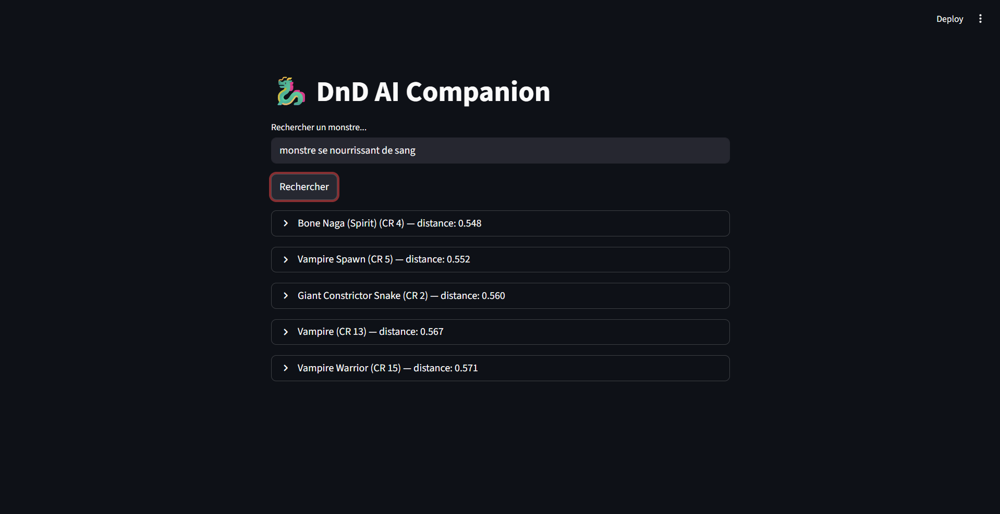

# 🐉 DnD AI Companion

> Moteur de recherche sémantique pour Maîtres du Jeu D&D 5e — pipeline RAG complet sur données 5etools

---

## Le problème

Pendant une session de Donjons & Dragons, le Maître du Jeu consulte constamment des dizaines de sources : statistiques de monstres, effets de sorts, règles variantes, objets magiques. Ces interruptions cassent le rythme de jeu.

**DnD AI Companion** résout ce problème avec la recherche sémantique : une description en langage naturel suffit pour retrouver l'entité recherchée, en français ou en anglais, sans connaître le nom exact.

---

## 💼 Transposable en contexte professionnel

Le même pipeline RAG s'applique à tout corpus documentaire structuré où la recherche exacte ne suffit pas :

| Secteur | Cas d'usage |
|---------|-------------|
| Machines spéciales | Retrouver la fiche technique d'un composant hydraulique pendant une mise en service |
| Agroalimentaire | Identifier la norme hygiène HACCP applicable à une ligne de production |
| Logiciel / ESN | Retrouver les spécifications d'une API tierce pendant un sprint |
| Pharmacie / MedTech | Identifier une exigence réglementaire FDA ou CE pour un dossier de certification |
| Conseil / Intégration | Retrouver une clause contractuelle spécifique dans un appel d'offres de 200 pages |

---

## Démo



*Requête : "monstre se nourrissant de sang" → Vampire Spawn, Bone Naga, Vampire (CR 13)...*

---

## Architecture

```
Données 5etools (JSON)
        │
        ▼
  Parsers par type          ← 14 parsers (monster, spell, item, class, rule...)
        │                      1 entité = 1 chunk, ID stable type:nom:source
        ▼
  ChromaDB (11 collections) ← embeddings paraphrase-multilingual-MiniLM-L12-v2
        │                      métrique cosinus, 384 dimensions
        ▼
  Recherche sémantique      ← requête FR ou EN → TOP_K résultats classés
        │
        ▼
  Interface Streamlit        ← Phase 1 : recherche monster_mm
```

---

## Stack technique

| Composant | Technologie |
|-----------|-------------|
| Langage | Python 3.13.5 |
| Base vectorielle | ChromaDB 1.5.9 |
| Modèle d'embedding | `paraphrase-multilingual-MiniLM-L12-v2` (384 dim, multilingue FR/EN) |
| Métrique | Cosinus |
| Interface | Streamlit |
| Tests | pytest (38/38 ✅) |
| Gestion dépendances | uv |

---

## Résultats RAG — Phase 1

Évaluation sur 150 questions, 7 catégories, TOP_K=10.

**Métriques :**
- **MRR** (Mean Reciprocal Rank) : le bon résultat apparaît-il en tête de liste ? MRR=0.627 signifie que la bonne réponse est en 1ère ou 2ème position dans ~63% des cas.
- **nDCG** (Normalized Discounted Cumulative Gain) : qualité du classement global — un bon résultat en position 2 vaut plus qu'en position 8. Pénalise les bons résultats relégués en bas de liste.
- **Coverage** : pourcentage de questions où la bonne réponse apparaît quelque part dans le TOP_10. Coverage=81% signifie que 19% des questions ne trouvent aucune réponse pertinente.

**Scores par catégorie :**

| Catégorie | n | MRR | nDCG | Coverage | Observation |
|---|---|---|---|---|---|
| temporal | 22 | 0.781 | 0.774 | 93% | ✅ Meilleure catégorie — keywords précis |
| direct_fact | 22 | 0.740 | 0.766 | 91% | ✅ Bon — faits uniques et discriminants |
| numerical | 22 | 0.697 | 0.738 | 90% | ✅ Bon — valeurs numériques présentes |
| holistic | 21 | 0.586 | 0.628 | 79% | 🟡 Moyen — plusieurs entités concernées |
| relationship | 20 | 0.590 | 0.590 | 69% | 🟡 Moyen — relations inter-entités |
| spanning | 21 | 0.562 | 0.618 | 82% | 🟡 Moyen — croisement d'infos |
| **comparative** | 22 | **0.425** | **0.467** | **63%** | ❌ Point faible — keywords génériques |


> **Baseline solide** : MRR=0.627 obtenu avec embeddings seuls, sans LLM, sans filtrage metadata. La Phase 2 ciblera les requêtes comparatives (MRR 0.425) via filtrage metadata ChromaDB et évaluation RAGAS.

---

## Installation

### Prérequis

- Python 3.13+
- [uv](https://docs.astral.sh/uv/)
- Données 5etools v2.28.0 → [5etools-mirror-2](https://github.com/5etools-mirror-2/5etools-mirror-2)

### Étapes

```bash
# 1. Cloner le repo
git clone https://github.com/AlexGMathieu/dnd-ai-companion.git
cd dnd-ai-companion

# 2. Installer les dépendances
uv sync

# 3. Configurer le chemin des données 5etools dans notebooks/02_ingestion_production.py

# 4. Lancer l'ingestion
uv run python notebooks/02_ingestion_production.py

# 5. Lancer l'interface
uv run streamlit run ui/streamlit_app.py
```

---

## Roadmap

| Phase | Statut | Résultat utilisateur | Stack ajoutée |
|-------|--------|----------------------|---------------|
| **Phase 1** — RAG Baseline | ✅ Terminée | Recherche sémantique monsters (FR/EN), évaluation MRR/nDCG | ChromaDB, Streamlit, pytest |
| **Phase 2** — API & Évaluation LLM | 🔜 | Recherche multi-collections via API REST, amélioration comparative | FastAPI, RAGAS |
| **Phase 3** — Interface MJ | 📋 | Fiches enrichies, liens internes, lexique FR/EN | Streamlit avancé |
| **Phase 4** — GUI avancée | 📋 | Onglets, filtres, switch édition 2014/2024 | React (vibe coding) |
| **Phase 5** — LLM local | 📋 | Réponses génératives sans API externe | Ollama + Gemma 9B |

---

## Structure du projet

```
dnd-ai-companion/
├── parsers/
│   ├── base_parser.py
│   ├── monster_parser.py
│   ├── spell_parser.py
│   ├── item_parser.py
│   ├── background_parser.py
│   ├── class_parser.py
│   ├── subclass_parser.py
│   ├── feat_parser.py
│   ├── trap_parser.py
│   ├── table_parser.py
│   ├── rule_parser.py
│   ├── race_parser.py
│   ├── tag_resolver.py
│   └── text_extractor.py
├── db/
│   ├── ingestion.py
│   └── master_ingestor.py
├── evaluation/
│   ├── generate_golden_dataset.py
│   ├── test_model.py
│   ├── eval.py
│   └── tests.jsonl
├── ui/
│   └── streamlit_app.py
├── tests/
│   └── test_*.py (13 fichiers, 38 tests)
└── notebooks/
    ├── 01_ingestion_test.py
    └── 02_ingestion_production.py
```

---

## Auteur

**Alexandre G. Mathieu** — reconversion marketing B2B industriel → AI Engineering

[](https://www.linkedin.com/in/alexandre-g-mathieu/)
[](https://github.com/AlexGMathieu)